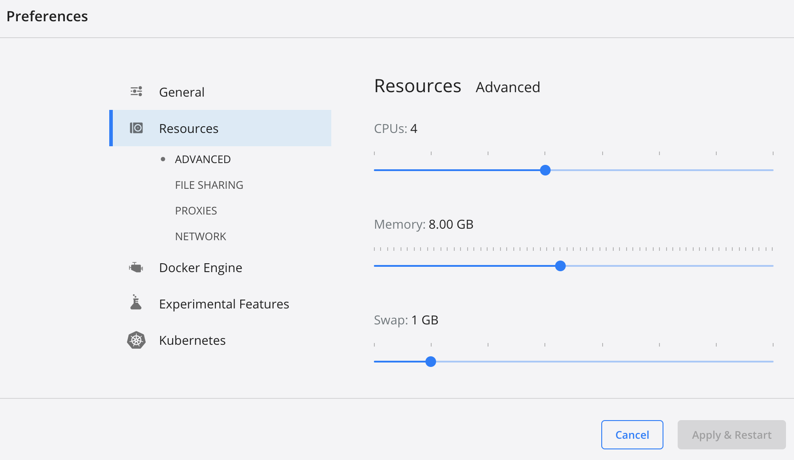

# graal-containers

## Introduction

***Credits: @krisfoster https://github.com/krisfoster/graal-containers***

This repo will walk you through building containerised apps with GraalVM JDK and Native Image.

We will be using a Spring Boot application as our test-bed. This is a fairly simple app that
generates a nonsense verse, in the style of the poem Jabberwocky (by Lewis Carrol). To do this remarkable
feat it uses a Markov chain to model the text of the original poem and this model is then used to generate random text that appear to be like the original.

## GraalVM Enterprise container images

This lab contains examples of both GraalVM Enterprise (ee) and GraalVM Community (ce) container images. GraalVM Enterprise container images are available in Oracle Container Registry (OCR) at https://container-registry.oracle.com in the GraalVM product section. In order to use the GraalVM Enterprise container images, you will need to create an Oracle account (no credit card needed), sign in with your Oracle account and accept the license under for GraalVM Enterprise `jdk-ee` and `native-image-ee` repositories.

1. Go to OCR at https://container-registry.oracle.com

2. Click on the `GraalVM` tile in the `Browse Containers` section.

3. Click on the `native-image-ee` repository.

4. Click on the `Sign In` button. You will be redirected to the `Oracle account sign-in` page.

5. If you already have an Oracle account, you can sign in. If not, click on the `Create Account` button in the `Don't have an Oracle Account?` section.

6. Once you've signed in, you can view and accept the license agreement for the Oracle container (`native-image-ee`) you have selected.

7. Go to `GraalVM Repositories` >> `jdk-ee`.

8. View and accept the license agreement for the Oracle container (`jdk-ee`) you have selected.


## App JAR

### Build the App JAR

We have a shell script that uses multistage Docker build to build a JAR file (using `mvn`) and ship the app JAR in a separate runtime docker image.

```bash
./step0.sh
```

If you are prompted to `docker login` to OCR, enter you OCR user and password.

Run this command to see the docker image:

```bash
docker images -a
```
Here's the output of the command:
```
REPOSITORY                   TAG      IMAGE ID       CREATED       SIZE
jibber-jar-gvmee2130-jdk17   0.0.1    40d34310d953   2 hours ago   613MB
```

### Run the App JAR

A Docker Compose has ben provided that will start the container, plus cAdvisor and Prometheus. Most sections have been commented out. Feel free to uncomment sections, as needed.

The other tools - cAdvisor and Prometheus - will allow us to generate pretty graphs of the RSS (Resident Set Size) for the application running in the container.

With the `jibber-jar-gvmee-jdk17:` section uncommented, run the following command to run the app JAR.

```bash
docker-compose up --remove-orphans
```

This will now start the folloing version of the app, on port 8081. Access the following URL in a browser and you should see a nonsense verse. 

* Java: http://localhost:8081/jibber

### Stop the App JAR

From another terminal window, run the following command:

```bash
docker-compose stop
```

## App Native Executable

### Build the App Native Executable

You can use GraalVM Native Image to generate a native executable for this app. We have another shell script that uses multistage Docker build to build the app JAR, generate the app native executable and  ship the native executable in a separate runtime docker image.

```bash
./step1-ee.sh
```
If you are prompted to `docker login` to OCR, enter you OCR user and password.

**Note:** To use the GraalVM Community edition instead of the GraalVM Enterprise edition, use `./step1-ce.sh`.

Run this command to see the new docker image:

```bash
docker images -a
```
Here's the output of the command:
```
REPOSITORY                  TAG     IMAGE ID       CREATED       SIZE
jibber-ni-gvmee2130-jdk17   0.0.1   daa1a94f4104   2 hours ago   196MB
```

### Troubleshoot Native Image Build Errors

You may see this error while generating the native executable.

```
Image build request failed with exit status 137
```

Exit status 137 indicates an out of memory error. Try increasing the memory for Docker resource. On Mac, go to Docker Desktop >> Settings >> Resources. Increase the memory to 8 GB or higher.

***Credits: https://stackoverflow.com/questions/68148868/micronaut-cannot-build-native-image-graalvm***




### Run the App Native Executable

Comment the `jibber-jar-gvmee-jdk17:` section. Uncomment the `jibber-nibase` section and run the following command to run the app native executable.

```bash
docker-compose up --remove-orphans
```

This will now start the following version of the app, on port 8082:

* Native Executable (generated by Native Image) : http://localhost:8082/jibber

### Stop the App Native Executable

From another terminal window, run the following command:

```bash
docker-compose stop
```

## Purge all Docker Resources - Images, Containers, Volumes, and Networks

***Credits: https://www.digitalocean.com/community/tutorials/how-to-remove-docker-images-containers-and-volumes***

Docker provides a single command that will clean up any resources — images, containers, volumes, and networks — that are dangling (not tagged or associated with a container). To additionally remove any stopped containers and all unused images (not just dangling images), add the -a flag to the command:

```bash
docker system prune -a
```

## Use OCI DevOps

Let's see how we can automate the build and deployment using the OCI DevOps service.

### DevOps Dynamic Groups and IAM Policies

#### DevOps Connections and Repositories

1. Create a dynamic group for all DevOps Connections and Repositories in your compartment.
    ```
    Name: dg-dev-comp-devops-conn-repo

    Description: Dynamic group for all DevOps Connections and Repositories in compartment dev

    Matching Rules:
        Match any rules defined below
        
        Rule 1
            ALL {resource.type = 'devopsconnection', resource.compartment.id = 'ocid1.compartment.oc1..aaa...xyz'}

        Rule 2
            ALL {resource.type = 'devopsrepository', resource.compartment.id = 'ocid1.compartment.oc1..aaa...xyz'}

    ```

2. In your compartment, create a policy to allow DevOps Connections and Repositories to access your GitHub personal access token (PAT) from the OCI Vault.
    ```
    Compartment: dev

    Name: devops-vault-access

    Description: Policy to allow DevOps Connections and Repositories to access your GitHub/GitLab PAT from the Vault

    Policy Statements:
        Allow dynamic-group dg-dev-comp-devops-conn-repo to read secret-family in compartment dev

    ```

#### DevOps Build Pipelines

1. Create a dynamic group for all DevOps Build Pipelines in your compartment.
    ```
    Name: dg-dev-comp-devops-build-pipeline

    Description: Dynamic group for all DevOps Build Pipelines in compartment dev

    Matching Rules:
        Match any rules defined below
        
        Rule 1
            ALL {resource.type = 'devopsbuildpipeline', resource.compartment.id = 'ocid1.compartment.oc1..aaa...xyz'}

    ```

2. In your compartment, create a policy for DevOps build pipelines.
    ```
    Compartment: dev

    Name: devops-build-pipelines-policies

    Description: Policy needed for DevOps build pipelines

    Policy Statements:
        Allow dynamic-group dg-dev-comp-devops-build-pipeline to manage repos in compartment dev
        
        Allow dynamic-group dg-dev-comp-devops-build-pipeline to read secret-family in compartment dev
        
        Allow dynamic-group dg-dev-comp-devops-build-pipeline to manage devops-family in compartment dev
        
        Allow dynamic-group dg-dev-comp-devops-build-pipeline to manage generic-artifacts in compartment dev
        
        Allow dynamic-group dg-dev-comp-devops-build-pipeline to use ons-topics in compartment dev

    ```

#### DevOps Deployment Pipelines

1. Create a dynamic group for all DevOps Deployment Pipelines in your compartment.
    ```
    Name: dg-dev-comp-devops-deploy-pipeline

    Description: Dynamic group for all DevOps Deployment Pipelines in compartment dev

    Matching Rules:
        Match any rules defined below
        
        Rule 1
            ALL {resource.type = 'devopsdeploypipeline', resource.compartment.id = 'ocid1.compartment.oc1..aaa...qba'}

    ```

2. In your compartment, create a policy for Deployment Pipelines. 
    ```
    Compartment: dev

    Name: devops-deploy-pipelines-policies

    Description: Policy needed for DevOps deploy pipelines

    Policy Statements:
        Allow dynamic-group dg-dev-comp-devops-deploy-pipeline to manage all-resources in compartment ssp-tf-play

    ```

### Store your GitHub PAT, OCR user and OCR password in the OCI Vault

1. Create an OCI Vault in the compartment `dev`.

2. In this Vault, create a master encryption key in the same compartment.

3. In this Vault, create a secret for your `GitHub personal access token (PAT)` in the same compartment.

4. In this Vault, create a secret for your `Oracle Container Registry (OCR) user` in the same compartment.

5. In this Vault, create a secret for your `Oracle Container Registry (OCR) password` in the same compartment.

6. Go to the [build_spec_step0.yaml](./build_spec_step0.yaml) file and update the OCID value of the `REGISTRY_USER` and `REGISTRY_PASS` in the `vaultVariables` section.

7. Go to the [build_spec_step1_ee.yaml](./build_spec_step1_ee.yaml) file and update the OCID value of the `REGISTRY_USER` and `REGISTRY_PASS` in the `vaultVariables` section.


### Use OCI DevOps to build the app JAR (step0)

1. Mirror the GitHub repo `DevOps Project >> Code repositories >> Mirror repository`.

2. Each time you make a change to the GitHub repo, synchornize the changes in the OCI. `DevOps Project >> Code repositories >> github_graal-containers >> Synchronize now`.

3. Create a `Build pipeline`.

4. From `Build pipelines >> Parameters`, add a new parameter with the following details:
    ```
    Name: REGISTRY_NAME
    Default value: container-registry.oracle.com
    ```
    Click `+` to add.

5. From `Build pipelines`, add a `Stage >> Managed Build` to the build pipeline. Enter the following details:
    ```
    Stage name: Build the app JAR in the jdk-ee container

    Description: Build the app JAR in the GraalVM jdk-ee container

    Build spec file path: build_spec_step0.yaml
    ```
    For the `Primary code repository`, select the following values:
    ```
    Source: Connection type: OCI Code Repository
    
    From the list of repos, select the "github_graal-containers" repo.

    Select Branch: main

    Build source name: gvmee
    ```
    Leave all other values unchanged.

    **Note:** The `Build source name` is the name of the folder where the build service will check out the code from the repository.


6. Test the build pipeline by clicking the `Start manual run` button.

7. Add artifact. `<region-code>.ocir.io/<tenancy-namespace>/<repo-prefix>/jibber-jar-gvmee2130-jdk17:${BUILDRUN_HASH}`

8. Add a `Stage >> Deliver artifacts` after the Managed Build stage.

9. Go to OCIR and create an empty Private Repository named `<repo-prefix>/jibber-jar-gvmee2130-jdk17` in your compartment.

10. Test the build pipeline again by clicking the `Start manual run` button. The image should be pushed to the OCIR repo. 

11. To test the image on local, 
    - Mark the OCIR repo as public. 
    - Docker pull the new image (with the new tag) on local. 
    - Update the image tag in the docker-compose.yml file for the `jibber-jar-gvmee-jdk17` service. 
    - Run `docker-compose up --remove-orphans` to start the application on port 8080.
    - Run `docker ps -a` to check status of the running container.
    - Go to http://localhost:8080/jibber in a browser and you should see a nonsense verse.
    - Run `docker-compose stop` in another terminal window to start the application


## Use OCI DevOps to build the app native executable using GraalVM Enterprise (step1-ee)

1. If you haven't already mirrored your GitHub repo, mirror the GitHub repo `DevOps Project >> Code repositories >> Mirror repository`.

2. Each time you make a change to the GitHub repo, synchornize the changes in the OCI. `DevOps Project >> Code repositories >> github_graal-containers >> Synchronize now`.

3. Create a `Build pipeline`. 

4. From `Build pipelines >> Parameters`, add a new parameter with the following details:
    ```
    Name: REGISTRY_NAME
    Default value: container-registry.oracle.com
    ```
    Click `+` to add.

5. From `Build pipelines`, add a `Stage >> Managed Build` to the build pipeline. Enter the following details:
    ```
    Stage name: Build the app native executable in the native-image-ee container

    Description: Build the app native executable in the native-image-ee container

    Build spec file path: build_spec_step1_ee.yaml
    ```
    For the `Primary code repository`, select the following values:
    ```
    Source: Connection type: OCI Code Repository
    
    From the list of repos, select the "github_graal-containers" repo.

    Select Branch: main

    Build source name: gvmee-native
    ```
    Leave all other values unchanged.

7. Test the build pipeline by clicking the `Start manual run` button.

8. Add artifact. Enter the following details: 
    ```
    Name: jibber-ni-gvmee2130-jdk17

    Type: Container image repository

    Enter the fully qualified path to the image in Container Registry: (replace the values based on your region and tenancy namespace)
        phx.ocir.io/your-tenancy-namespace/gvmee/jibber-ni-gvmee2130-jdk17:${BUILDRUN_HASH}

    Replace parameters used in this artifact:
        Yes, substitute placeholders
    ```
    Click Add.

9. Add a `Stage >> Deliver artifacts` after the Managed Build stage.
    ```
    Stage name: Push the runtime image containing the app native executable to OCIR

    Description: Push the runtime image containing the app native executable to OCIR

    Select artifacts: jibber-ni-gvmee2130-jdk17

    Associate artifacts with build result:
        Destination DevOps artifact name: jibber-ni-gvmee2130-jdk17
        Type: Docker image
        Build config/result artifact name: Build_output_image (should match the "name" of the "outputArtifacts" from your build_spec_step1.yml file)
    ```

10. Go to OCIR and create an empty Private Repository named `gvmee/jibber-ni-gvmee2130-jdk17` in your compartment.

11. Test the build pipeline again by clicking the `Start manual run` button. The runtime image should be pushed to the OCIR repo. 

12. To test the image on local, 
    - Mark the OCIR repo as public. 
    - Optionally, docker pull the new image (with the new tag) on local. 
    - Update the image tag in the docker-compose.yml file for the `jibber-ni-gvmee-jdk17` service. 
    - Run `docker-compose up --remove-orphans` to start the application on port 8080.
    - Run `docker ps -a` to check status of the running container.
    - Go to http://localhost:8082/jibber in a browser and you should see a nonsense verse.
    - Run `docker-compose stop` in another terminal window to start the application


## Use OCI DevOps to build the app native executable using GraalVM Community Edition (step1-ce)

1. If you haven't already mirrored your GitHub repo, mirror the GitHub repo `DevOps Project >> Code repositories >> Mirror repository`.

2. Each time you make a change to the GitHub repo, synchornize the changes in the OCI. `DevOps Project >> Code repositories >> github_graal-containers >> Synchronize now`.

3. Create a `Build pipeline`. 

4. From `Build pipelines`, add a `Stage >> Managed Build` to the build pipeline. Enter the following details:
    ```
    Stage name: Build the app native executable in the native-image container

    Description: Build the app native executable in the native-image container

    Build spec file path: build_spec_step1_ce.yaml
    ```
    For the `Primary code repository`, select the following values:
    ```
    Source: Connection type: OCI Code Repository
    
    From the list of repos, select the "github_graal-containers" repo.

    Select Branch: main

    Build source name: gvmce-native
    ```
    Leave all other values unchanged. 
    
    Click `Add`.

7. Test the build pipeline by clicking the `Start manual run` button.

8. Add artifact. Enter the following details: 
    ```
    Name: jibber-ni-gvmce22-jdk17

    Type: Container image repository

    Enter the fully qualified path to the image in Container Registry: (replace the values based on your region and tenancy namespace)
        phx.ocir.io/your-tenancy-namespace/gvm/jibber-ni-gvmce22-jdk17:${BUILDRUN_HASH}

    Replace parameters used in this artifact:
        Yes, substitute placeholders
    ```
    Click Add.

9. Add a `Stage >> Deliver artifacts` after the Managed Build stage.
    ```
    Stage name: Push the runtime image containing the app native executable to OCIR

    Description: Push the runtime image containing the app native executable to OCIR

    Select artifacts: jibber-ni-gvmce22-jdk17

    Associate artifacts with build result:
        Destination DevOps artifact name: jibber-ni-gvmce22-jdk17
        Type: Docker image
        Build config/result artifact name: Build_output_image (should match the "name" of the "outputArtifacts" from your build_spec_step1_ce.yml file)
    ```
    Click `Add`.

10. Go to OCIR and create an empty Private Repository named `gvm/jibber-ni-gvmce22-jdk17` in your compartment.

11. Test the build pipeline again by clicking the `Start manual run` button. The runtime image should be pushed to the OCIR repo. 

12. To test the image on local, 
    - Mark the OCIR repo as public. 
    - Update the image tag in the docker-compose.yml file for the `jibber-ni-gvmce-jdk17` service. 
    - Run `docker-compose up --remove-orphans` to start the application on port 8080.
    - Run `docker ps -a` to check status of the running container.
    - Go to http://localhost:8083/jibber in a browser and you should see a nonsense verse.
    - Run `docker-compose stop` in another terminal window to stop the application.
    - Mark the OCIR repo as private. 
    
